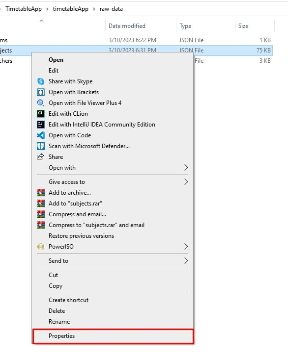

# Timetable App

## First time installation

### Download NodeJS [https://nodejs.dev/en/download/] 
### Download and install the following MongoDB stuff : 
 [MongoDB Database Tools]  [https://fastdl.mongodb.org/tools/db/mongodb-database-tools-windows-x86_64-100.7.0.zip]
 [MongoDB Compass]  [https://downloads.mongodb.com/compass/mongodb-compass-1.35.0-win32-x64.exe]
 [MongoDB Community Server]  [https://fastdl.mongodb.org/windows/mongodb-windows-x86_64-6.0.4-signed.msi]
 [Mongo Shell] [https://downloads.mongodb.com/compass/mongosh-1.8.0-win32-x64.zip]

### If you want to load static data :
    - Go to "./timetableApp/reset-database" and edit the --file option with the absolute path of their respective json paths which are in "./timetableApp/raw-data"
    For ex :
     mongoimport --uri "mongodb://localhost:27017/timetable"  --jsonArray --collection subjects --file "<absolute-path>"
  []
  []
  []
   ### execute the setup file in reset-database ('./timetableApp/reset-database/setup.sh')
    
### Replace the string path on line 14  in "timetableFinal\timetableApp\main\backend\controller\timetable.controller" with the absolute path of users.xlsl in "timetableFinal\timetableApp\main\backend\users.xlsx"

 []
 []
 
### installServerDependencies ('./installServerDependencies')
 
### installClientDependencies ('./installClientDependencies')
    
## Execution
### Run your app by executing the scripts launchServer ('./launchApp.sh') and launchClient ('./launchClient.sh')
